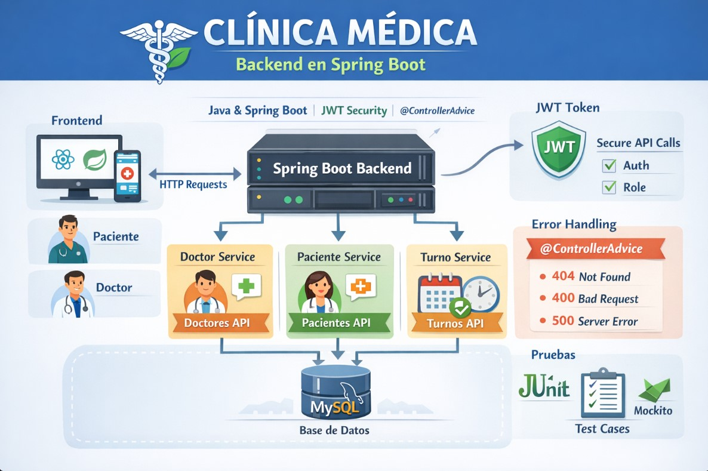

# Clínica Médica - Spring Boot

## 📌 Descripción

Este proyecto es un **backend REST** desarrollado con **Spring Boot**, enfocado en la gestión de una **clínica médica**. Implementa una arquitectura por capas (**Controller → Service → Repository**), utiliza **DTOs** (request/response), manejo centralizado de **excepciones** y una capa de **seguridad** basada en filtros.

---

## 🧱 Estructura del Proyecto

```css
.
├── .idea/                         # Configuración de IntelliJ (opcional)
├── .mvn/                          # Maven Wrapper
│   └── wrapper/
├── pom.xml                        # Dependencias y configuración Maven (si aplica)
├── src/
│   ├── main/
│   │   ├── java/com/backend/clinica
│   │   │   ├── config/             # Configuraciones (beans, CORS, etc.)
│   │   │   ├── controller/         # Controladores REST
│   │   │   ├── dto/                # Objetos de transferencia de datos
│   │   │   │   ├── request/        # DTOs de entrada (requests)
│   │   │   │   └── response/       # DTOs de salida (responses)
│   │   │   ├── entity/             # Entidades (modelos JPA)
│   │   │   ├── exception/          # Manejo global de errores / excepciones
│   │   │   ├── repository/         # Acceso a datos (Spring Data)
│   │   │   ├── security/           # Config de seguridad
│   │   │   │   └── filter/         # Filtros (JWT / auth, etc.)
│   │   │   └── service/            # Lógica de negocio
│   │   │       └── imp/            # Implementaciones de servicios
│   │   └── resources/
│   │       ├── static/             # Recursos estáticos (css/img/js)
│   │       └── templates/          # Vistas (Thymeleaf si aplica)
│   └── test/
│       └── java/com/backend/clinica/ # Tests
└── target/                          # Salida de build (generado por Maven)
```

---

## ⚙️ Tecnologías Usadas

* **Java** (versión según tu entorno)
* **Spring Boot**
* **Spring Web**
* **Spring Data JPA** (si aplica)
* **Spring Security** (capa `security/` y filtros)
* **Maven** (Wrapper incluido)
* **JUnit 5** (tests)
* **Thymeleaf** (si aplica, por `templates/`)

---

## 🗄️ Configuración (BD y propiedades)

Los archivos de configuración se encuentran en:

```text
src/main/resources/
```

Normalmente aquí tendrás `application.properties` o `application.yml` con:

* conexión a base de datos
* puerto
* variables de seguridad (JWT, etc.)
* configuración de logs


---

## 🚀 Cómo Ejecutar el Proyecto

### Pre-requisitos

* Java (JDK)
* Maven (opcional, porque ya tienes Maven Wrapper)

### Ejecutar con Maven Wrapper

```bash
./mvnw spring-boot:run
```

En Windows (PowerShell):

```powershell
./mvnw spring-boot:run
```

---

## 📦 Build

```bash
./mvnw clean package
```

El artefacto se genera en `target/`.

---

## 💪 Tests

Ruta de tests:

```text
src/test/java/com/backend/clinica/
```

Ejecutar:

```bash
./mvnw test
```

---

## 📁 Rutas de Interés

A continuación se detallan los **endpoints REST** expuestos por la aplicación, organizados por módulo:

### 👨‍⚕️ Doctores

| Método | Ruta                    | Descripción                    |
| -----: | ----------------------- | ------------------------------ |
|    GET | `/api/v1/doctores`      | Listar todos los doctores      |
|   POST | `/api/v1/doctores`      | Crear un nuevo doctor          |
|    GET | `/api/v1/doctores/{id}` | Obtener un doctor por ID       |
|    PUT | `/api/v1/doctores/{id}` | Actualizar un doctor existente |
| DELETE | `/api/v1/doctores/{id}` | Eliminar un doctor             |

### 🧑‍🤝‍🧑 Pacientes

| Método | Ruta                     | Descripción                      |
| -----: | ------------------------ | -------------------------------- |
|    GET | `/api/v1/pacientes`      | Listar todos los pacientes       |
|   POST | `/api/v1/pacientes`      | Crear un nuevo paciente          |
|    GET | `/api/v1/pacientes/{id}` | Obtener un paciente por ID       |
|    PUT | `/api/v1/pacientes/{id}` | Actualizar un paciente existente |
| DELETE | `/api/v1/pacientes/{id}` | Eliminar un paciente             |

### 📅 Turnos

| Método | Ruta                  | Descripción                   |
| -----: | --------------------- | ----------------------------- |
|    GET | `/api/v1/turnos`      | Listar todos los turnos       |
|   POST | `/api/v1/turnos`      | Crear un nuevo turno          |
|    GET | `/api/v1/turnos/{id}` | Obtener un turno por ID       |
|    PUT | `/api/v1/turnos/{id}` | Actualizar un turno existente |
| DELETE | `/api/v1/turnos/{id}` | Eliminar un turno             |

---

-----|-------:|------|-------------|
| (Ej: Pacientes) | GET | `/api/v1/...` | ... |
| (Ej: Médicos)   | POST | `/api/v1/...` | ... |
| (Ej: Citas)     | PUT | `/api/v1/...` | ... |

---

## 🛠️ Manejo de Errores

La carpeta `exception/` suele contener:

* Excepciones personalizadas
* Un manejador global tipo `@ControllerAdvice` para respuestas consistentes

---

## 🔐 Seguridad

La carpeta `security/` y `security/filter/` contiene la configuración de seguridad.

> Si estás usando JWT, puedo documentar el flujo: login → token → headers → roles/permisos.

---

## 📄 Licencia

Este proyecto puede ser distribuido bajo licencia **MIT** (si corresponde). Agrega un archivo `LICENSE` en la raíz si deseas publicarlo.

---

## 📬 Contacto

Para dudas, sugerencias o contribuciones:

📧 **[casseli.layza@gmail.com](mailto:casseli.layza@gmail.com)**

🔗 [LinkedIn](https://www.linkedin.com/in/casseli-layza/)
🔗 [GitHub](https://github.com/CasseliLayza)

💡 **Desarrollado por Casseli Layza como parte de un curso/proyecto con Spring Boot.**

***💚 ¡Gracias por revisar este proyecto!... Powered by Casse 🌟📚🚀...!!***

## Derechos Reservados

```markdown
© 2026 Casse. Todos los derechos reservados.
```
